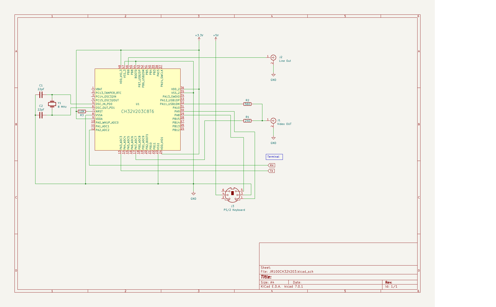

# JR-100 エミュレータ for CH32V203

中華マイコン CH32V203 用 JR-100 エミュレータです。
以下の機能を実装しています。

- MB8861 CPU
- 16KB RAM
- VRAM (+PCG)
- サウンド(手抜き)
- キーボード(PS2 or USART経由)

以下の機能は未実装です

- カセット制御

SAVE(MSAVE) で　USART に出力されますが、LOAD(MLOAD) は未実装です。
その代わり、F1 で直接ロードできます。

- 割り込み

タイマー割り込みを使うようなプログラムは動きません。

---
jr100rom.h には JR-100 実機の ROM (8KB) が必要です。
---
## 参考接続図

---

CPU のエミュレーションには MAME のコードを流用しています。
ビデオ出力は CH32V003 の時と同じコードを使っています。
サウンドは、6522 の単純エミュレーションでは綺麗な音にならなかったので、
CH32V203 のタイマー出力に焼き直しています。
そのため、完全なエミュレーションにはなっていません。 

RAMで16KB、VRAMで1KB 使っているので、スタックサイズを 2KB 確保している通常の CH32V203 のリンクスクリプトではメモリ不足になります。 

PS/2 キーボードに対応しました。
[Arduino に PS/2 キーボードを接続してみる](https://ht-deko.com/arduino/ps2_keyboard.html)
で公開されている日本語キーボード対応の Arduino 用ライブラリを改変して使用しています。 

SHIFT/CTRL は左側のみ対応します。(実機も左側にしかないですし…)
まれにキー入力の応答がなくなる時がありますが、左側ALTで復帰します。 

PS/2 キーボードを使用しないときは、シリアルポート(USART2) からキー入力を受け付けます。
特殊文字とかグラフィック記号は未対応です。 

---
## SAVE&LOAD

BASIC で SAVE/MSAVE コマンドを使うと、USART 上にテープのデータがダンプされます。
適当にテキストファイルに保存してください。 

PS/2 キーボードの F1 を押すと、ロードモードに入りますので、保存したテキストファイルを貼り付けしてください。
この時に Teraterm などの送信ディレイを適当に(1msとか)設定して取りこぼしがないようにしてください。
USARTから ! の入力があると、中断します。 